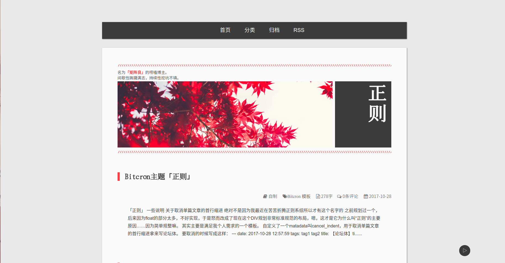
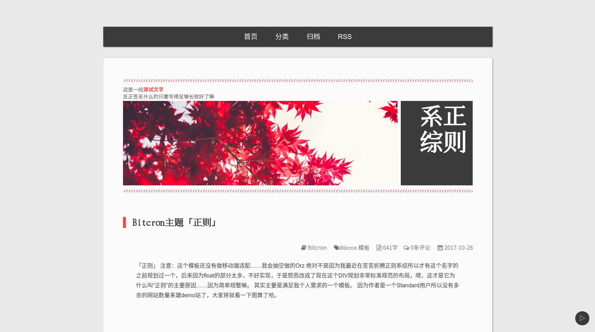

# Bitcron 主题 「正则」

> **注意：**这个模板还没有做移动端适配……我会抽空做的Orz

~~因为作者是一个Standard用户所以没有多余的网站数量来建demo站了，大家将就看一下图算了哈。~~



其实我比较推荐写两到四个字的博客名。

**特别是写四个字的，会比较好看。**



```table
| 名称 | 链接 |
| 主题 | 正则 |
| 说明 | [这里](https://matrixk.me/post/zi-zhi/bitcron-theme-canonical) |
| 源码 | [这里](https://github.com/matrixk/bitcron-theme-canonical) |
| 属性 | 开源免费（反正感觉也并没有人想用……） |
```

# 一些说明

> 其实也是一些我的个人需求……

## 关于取消单篇文章的首行缩进

~~绝对不是因为我最近在苦苦折腾正则系综所以才有这个名字的~~

之前规划过一个，后来因为float的部分太多，不好实现，于是怒而改成了现在这个DIV规划非常标准规范的布局，嗯，这才是它为什么叫“正则”的主要原因……因为简单规整嘛。

其实主要是满足我个人需求的一个模板。

自定义了一个`matadata`叫`cancel_indent`，用于取消单篇文章的首行缩进~~拿来写论坛体~~。

要取消的时候写成这样：

```
---
date: 2017-10-28 12:57:59
tags: tag1 tag2
title: 【论坛体】title
cancel_indent: True
status: public
---
```

**注意：**为了实现这个功能我把一般文章的缩进写死了，为2em，如果平时不需要缩进的，在`markdown.scss`里找一下`span.md_line`的部分，改成自己平时的缩进就好了。

## 关于博客头图

头图可以在`Dashboard`里面设置哇，在`images-Default Background`，由于我实在不知道怎么让图片垂直居中，所以上传前大家可以裁一下让图片主要部分露出来。

没有设置`Default Background`的话就是默认的那张图了。

# 最后……

谢谢小海龙（风海流）这几天陪我写这个模板帮我查Bug！

还有谢谢萌萌的[水八口](https://blog.shuiba.co/)姐姐的教程和模板，从她那里学到了很多～（花花给你.gif）
